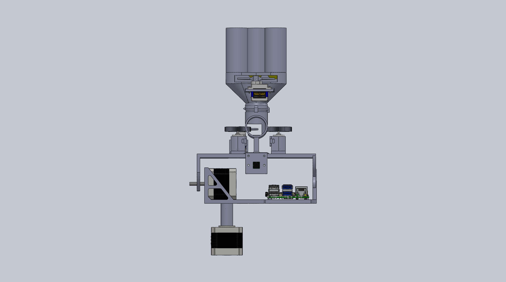
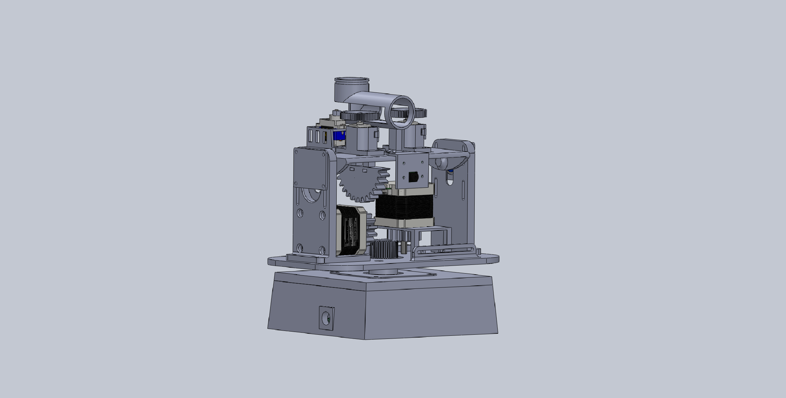
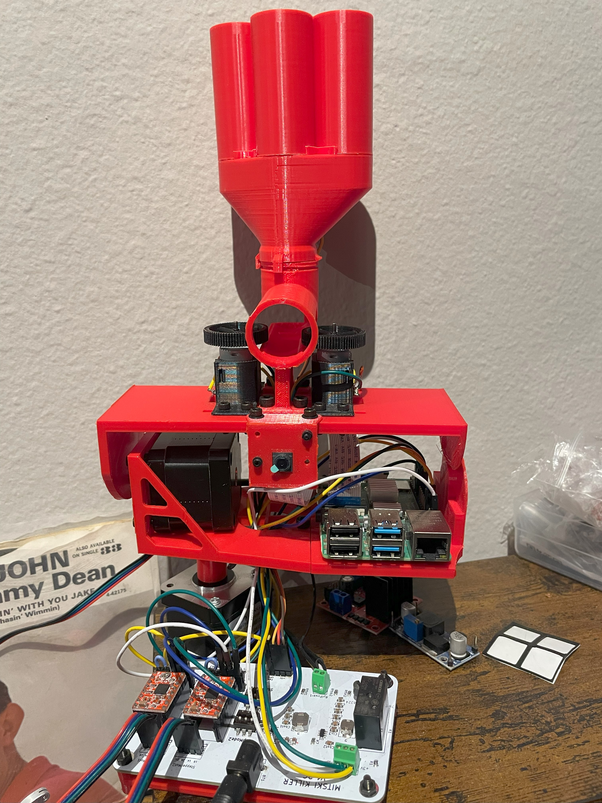
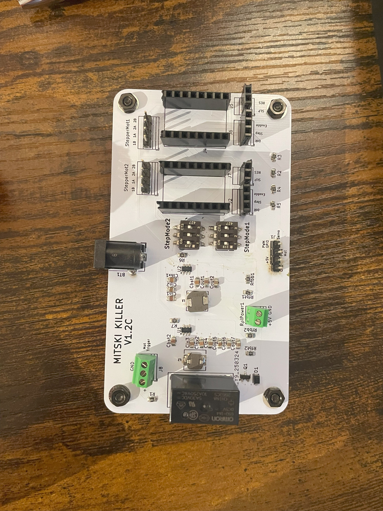
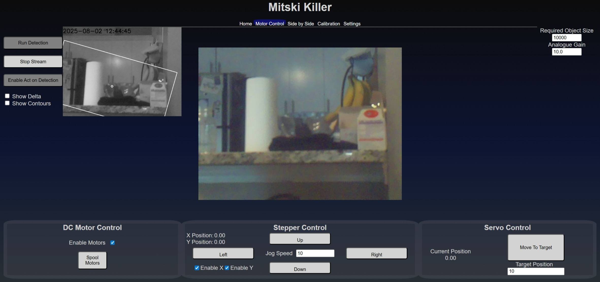

# Cam\_Tracking\_Pi

Raspberry Pi version

&nbsp;		Overview: This project aims at creating a motion detecting/tracking/firing system to terrorize an entitled and panther-looking cat named Mitski. The system consists mechanically of a tilt/pan table mounted launching system that fires 3/4 inch foam balls that Mitski can't resist. The tilt/pan table is driven via 2 Nema 17 stepper motors, the launching mechanism is powered via 2 hobby dc 130 motors in a spinning-barrel style firing mechanism. The motion detection/tracking is accomplished via a Raspberry Pi Cam which leads me to - the brains of the operation lie in a Raspberry Pi 4B SBC that hosts a GUI using Flask, drives the motors, runs the camera, and controls the process. The main software components include the web-based GUI hosted by the Pi utilizing Flask, the code to control the camera and image processing, and the motor control. One more component to mention is the custom PCB design made and iterated here to include 3 voltage supply levels for logic and motor voltage.

&nbsp;		So far this repo includes several mechanical and software iterations. CAD files have not been tracked via git and are instead stored and versioned in a local file storage system. Images are included in the Images folder

&nbsp;	This project began back in 2023 in the midst of my first post-college job and my initial attempt was using an ESP32 microcontroller based system with the goal of creating an extremely cheap system with minimal external libraries/resources see other repo, (Cam\_Tracking\_ESP). This proved to be difficult as I learned a lot and ultimately decided I needed a more powerful controller with a some amount of pre-built architecture. I then took a hiatus from this project and returned to it at the beginning of 2025 with a new architecture and plan that is this repo. Documentation/images are lacking in different areas as this wasn't originally intended to be shared but just a fun project

  
  
  
  
  

